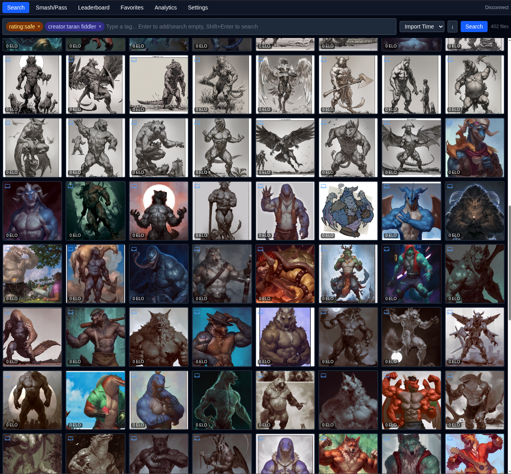

# hydrus-ui



Vibecoded. Here be dragons.

Hydrus Network web UI — tag rating, TrueSkill analytics, gallery browsing, and ELO distribution visualization.

- **Smash/Pass** — pairwise file voting with TrueSkill scoring, syncs inc/dec ratings to Hydrus API
- **Search** — full Hydrus tag search with thumbnail grid/mosaic layout, gallery carousel, inc/dec ELO & like overlays
- **Leaderboard** — top 500 files by inc/dec rating, sorted client-side
- **Favorites** — files liked on a like/dislike service
- **Analytics** — hover-dropdown with two views:
  - *Tag Preferences* — per-tag TrueSkill alignment (mu change) with sort/filter/min-appearances
  - *ELO Distribution* — bar chart of ELO rating vs submission count, dual source (localStorage cache or Hydrus leaderboard search), linear/log Y-axis toggle
- **Settings** — connection config, rating service selection, gallery layout mode, ratings cache rebuild, namespace colors

## Setup

```bash
cp .env.example .env
```

Edit `.env` to point `VITE_HYDRUS_API_URL` at your Hydrus client API (default `http://127.0.0.1:45869`).

```bash
npm install
npm run dev
```

Enter your Hydrus API access key in the Connection Settings screen on first load.

## Hotkeys

| Key | Context | Action |
|---|---|---|
| `a` / `ArrowLeft` | Smash/Pass | Choose left |
| `d` / `ArrowRight` | Smash/Pass | Choose right |
| `Space` / `s` | Smash/Pass | Draw |
| `a` / `d` / `ArrowLeft` / `ArrowRight` / `j` / `k` | Gallery | Previous / next file |
| `w` | Gallery | Toggle like on like/dislike service |
| `Home` | Gallery | First file |
| `End` | Gallery | Last file |
| `i` | Gallery | Toggle file info panel |
| `Escape` | Gallery / Global | Close gallery |
| `ArrowRight` / `ArrowDown` | Search grid | Select next file |
| `ArrowLeft` / `ArrowUp` | Search grid | Select previous file |
| `Enter` | Search grid | Open selected file in gallery |

All hotkeys are suppressed when typing in a text input (tag search bar).

## Stack

React 19, TypeScript 6, Vite 8, Zustand 5, TanStack React Query 5, Tailwind CSS 4, Recharts 3, Zod 4, idb 8, pdfjs-dist, ag-psd, Ruffle (SWF player).
